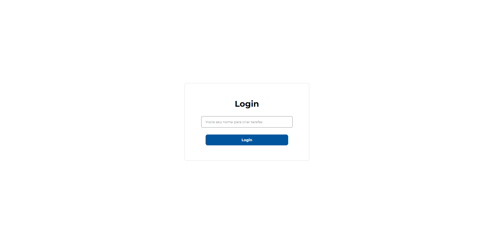
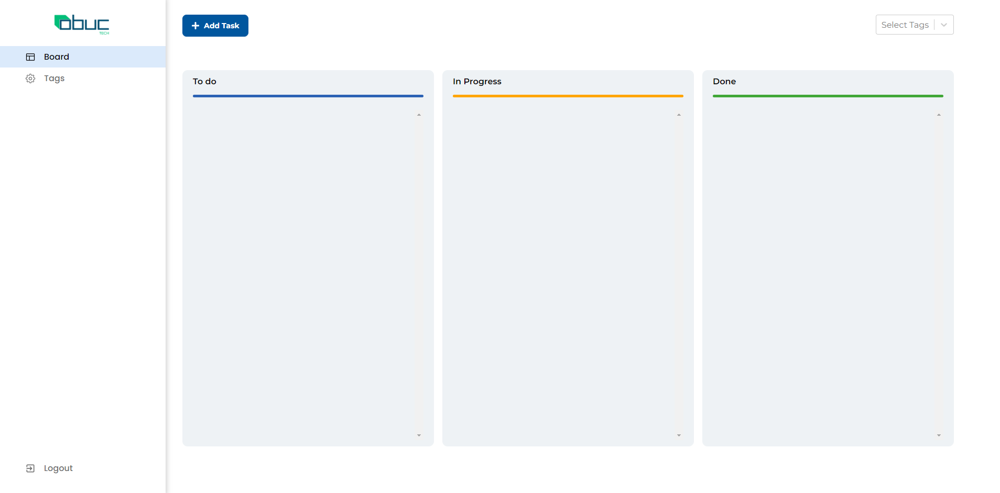
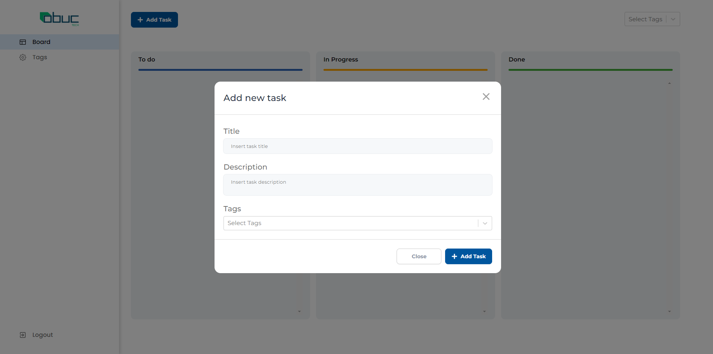
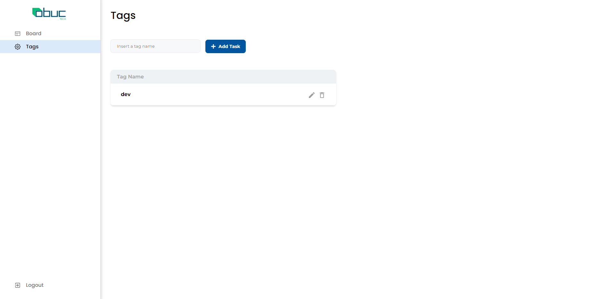
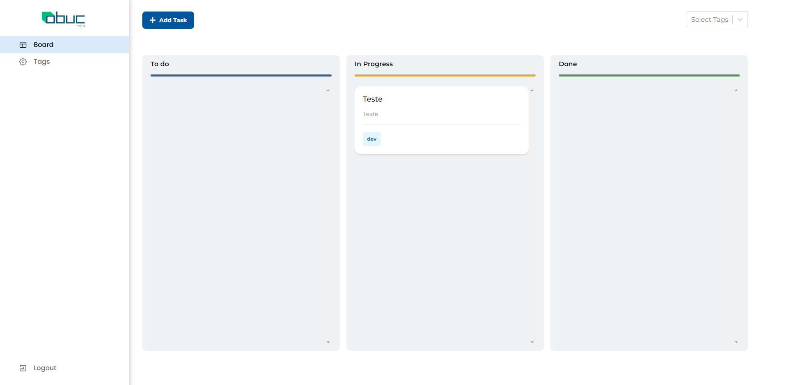

# Desafio técnico

Como descrito no arquivo recebido, nesse repositório encontra-se o código base para que desenvolva o desafio passado.
Para entrega do desafio, temos as seguintes tarefas:

## Melhorias essenciais 

1. Visualização em Kanban
2. Adicionar categoria de uma tarefa
3. Filtrar tarefa por categorias
4. Visualização direcionadas das tarefas

## Melhorias não essenciais 

1. Esconder tarefas antigas
2. Padronizar Layout
3. Testes

## Layout

Temos o [layout](https://www.figma.com/proto/CbOONNv1kIpV9C6PJC2i84/PS-Dev-Pl?page-id=0%3A1&node-id=1-2&node-type=frame&viewport=1173%2C489%2C0.58&t=6IbaDA5RxPZB00O8-1&scaling=min-zoom&content-scaling=fixed&starting-point-node-id=1%3A2&show-proto-sidebar=1) que deve ser usado como base para dar seguimento para o desenvolvimento.
Caso veja pontos de melhoria, sinta-se a vontade para modificar algo.

# Resultado do desafio

## Login
A tela de login não exige senha, apens solicita um nome de usuário para realizar os lançamentos.

* *(obs): A biblioteca adicionada no projeto para a autenticação era a auth0-react, mas não foi implementada.*

## Layout Kanban
O design seguiu a mesma ideia de ferramentas já existentes como o Trello ou Azure devops.
Para fazer toda a movimentação dos Cards, foi utilizada a biblioteca react-dnd (@hello-pangea/dnd)

## Adição de Tasks
A adição das Tasks ocorre através do Modal. 

* *(obs): Para identificar o responsável por cada Task utilizamos o próprio nome.*

## Adição de Tags
A adição das Tags ocorre através do Campo logo acima da lista. 

* *(obs): Para identificar o responsável por cada Tag utilizamos o nome informado no Login.*

## Tasks Cadastradas
Após o cadastro das TAGs, as mesmas podem ser utilizadas nos Cards e também podem ser filtradas no Select Options à direita.

### Bibliotecas adicionadas posteriormente:

* @auth0/auth0-react
* @hello-pangea/dnd
* sweetalert2